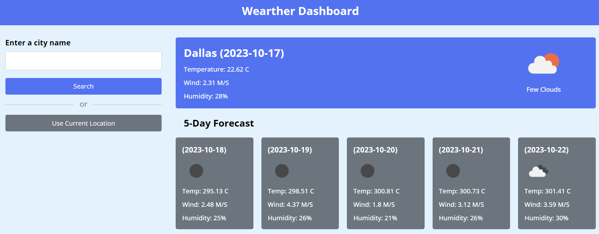

# Weather-Dashboard

# Description

A weather application that allows the user to search for a city of their choice and be able to receive the current weather and a forecast for the next 5 days.

# Usage

This project was created for an assignment. It will be used to check weather forecasts. It is a quick and easy way to check the weather before planning for future events.

GIVEN a weather dashboard with form inputs
WHEN I search for a city
THEN I am presented with current and future conditions for that city and that city is added to the search history
WHEN I view current weather conditions for that city
THEN I am presented with the city name, the date, an icon representation of weather conditions, the temperature, the humidity, and the the wind speed
WHEN I view future weather conditions for that city
THEN I am presented with a 5-day forecast that displays the date, an icon representation of weather conditions, the temperature, the wind speed, and the humidity
WHEN I click on a city in the search history
THEN I am again presented with current and future conditions for that city

# Deployed URL for webpage

https://madiemalee.github.io/Weather-Dashboard/

# Webpage Output

